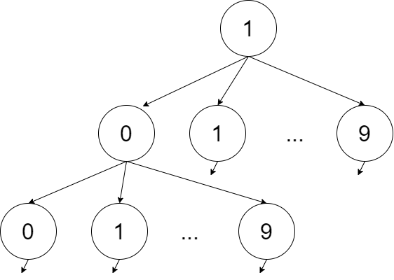

# 字典序的K-th Number

给定正整数区间$[1,n]$，请给出其中字典序第$k$小的数。

## 解答

用k-th element快速排序法，平均时间复杂度为$O(n)$，但还不够好。

我们考虑字典树（前缀树）。$10$进制正整数的字典序对应的字典树是一个$10$叉数，且对该字典树的先序遍历的各项结果，恰好排成了一个字典序。

就像这样：



先序遍历的结果为

```
1
10
100
...
101
...
109
11
110 
...
19
...
```

可见恰好为字典序。

### 字典树的性质

我们想要知道$[1,n]$之间有多少数以前缀$p$开头，怎么办呢？

先不考虑$n$的限制，我们发现，一个前缀子树对应的根$m$恰好有$10$个孩子，值恰好为$\{10m, 10m + 1, \dots, 10m +9\}$，且这个根的紧邻右兄弟恰好是$m+1$。例如，在上图所示的树中，$m = 10$恰好有$10$个孩子$\{(10)0, (10)1, \dots, (10)9)\}$，紧邻右兄弟恰好是$11$。

但是，在没有$n$的限制下，前缀子树的大小是无穷大的。为此，我们需要时刻记录$m$的最大孩子。如果它超越了$n$，那么累加结束。


心累了，不想写题解了。
