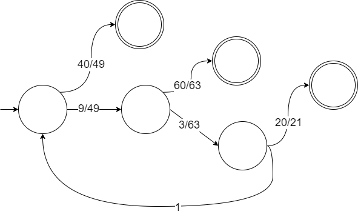

# 用rand7()实现rand10()

给定方法 `rand7` 可生成 `[1,7]` 范围内的均匀随机整数，试写一个方法 `rand10` 生成 `[1,10]` 范围内的均匀随机整数。

## 解答

标准解法：拒绝采样。

### 几何分布

用两次调用 `rand7()`来编码获取 `rand49()`，然后采样$[1,40]$，可获取$[1,10]$内的均匀随机整数。如果结果为$[41,49]$，重新调用两次 `rand7()`，直到结果在$[1,40]$为止。

这是一个简单的几何分布。由于 `rand49()`需要两次调用 `rand7()`获取，因此 `rand7()`调用的期望次数为$2 \cdot \frac{49}{40} = \frac{49}{20}$。

### 嵌套几何分布

我们如果能够利用拒绝采样得到的随机数，那么调用 `rand7()`的次数的期望还能减少一些。

具体而言，如果第一次的结果在$[41,49]$，则我们相当于得到了一个$[1,9]$的随机数，再调用一次 `rand7()`就能获得$[1,7 \times 9]$的随机数了。如果结果在$[61,63]$，这相当于得到了一个$[1,3]$的随机数，再调用一次 `rand7()`就能获得$[1,7 \times 3]$的随机数了。如果结果在$[21,21]$，那么这个结果已经不能再被利用，回到最开始的两次 `rand7()`。

状态转移图如下：

注意从初始状态出发的每一步转移的代价均为$2$（因为调用了两次 `rand7()`），其余边的代价均为$1$。

期望计算如下：

$$
\begin{aligned}
x &= 2 + \frac{9}{49}y, \\
y &= 1 + \frac{3}{63}z, \\
z &= 1 + \frac{1}{21}x. 
\end{aligned}
$$

因此 `rand7()`调用的期望次数为$x = \frac{307}{140}$。低于简单几何分布的期望。
